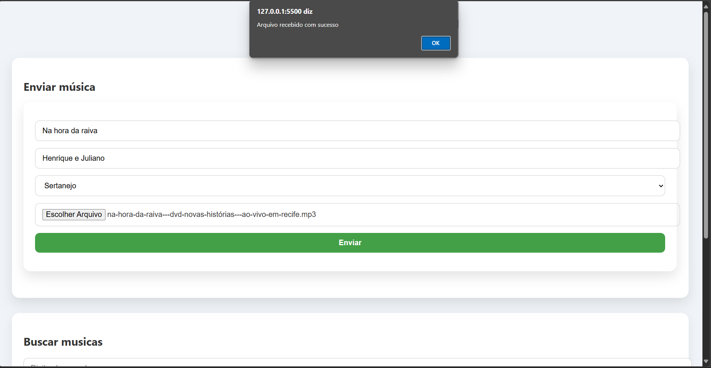
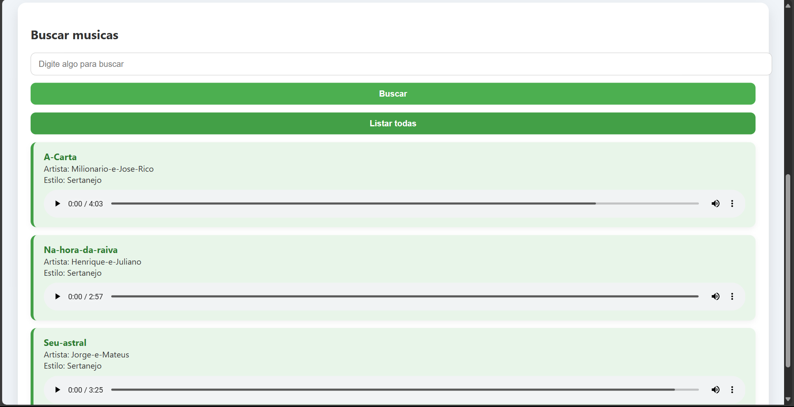

# 🎵 Play My Song

**Play My Song** é um sistema web desenvolvido durante a disciplina de *Ferramentas Computacionais 3*, com o objetivo de permitir o **upload, busca e reprodução de músicas** de forma simples e eficiente.

## 📌 Descrição

O projeto foi desenvolvido em equipe e tem como proposta centralizar e gerenciar arquivos de áudio. A aplicação permite que os usuários:

- Façam o **upload** de músicas com título, artista e estilo musical;
- **Busquem** músicas cadastradas;
- **Reproduzam** os áudios diretamente pela interface web.

## 🔧 Tecnologias Utilizadas

- 💻 **Back-end:**
  - Java
  - Spring Boot (API REST)

- 🌐 **Front-end:**
  - HTML
  - CSS
  - JavaScript

- 📁 **Armazenamento:**
  - Arquivos salvos localmente no servidor, com acesso via URL

## 🚀 Objetivo

Este projeto teve como objetivo aplicar na prática os conhecimentos adquiridos na disciplina, trabalhando conceitos como:

- Integração entre front-end e back-end
- Manipulação de arquivos no servidor
- Estruturação de APIs REST
- Trabalho em equipe

## 📷 Capturas de Tela

> ### Tela de upload de músicas

> ### Tela de listagem e reprodução

## 👨‍💻 Desenvolvedores

- Guilherme Silva Horta  
- João Claudio Martinez
- Caio Emerick Prosdossimi

---

Sinta-se à vontade para contribuir, enviar sugestões ou utilizar este projeto como base para novos aprendizados!

